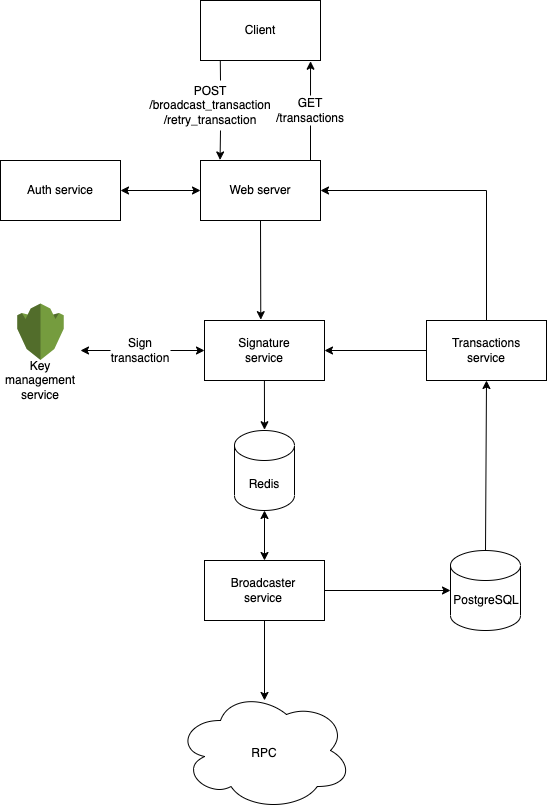

# Assumptions

1.  All transactions posted are valid, any failures will only be caused by network issues
2.  Signature wallet is assumed to have enough gas
3.  All transactions will be broadcasted with a reasonable baseFeePerGas, maxPriorityFeePerGas, and maxFeePerGas.
    1.  This means that transaction failures will not be the result of insufficient gas paid
4.  A transaction is considered to be successful once it receives a single block confirmation
5.  Page that shows the list of transactions that passed or failed does not require admin authentication.

# High level design

# Component specifications

## Use case 1: Admin attempts to broadcast the transaction

1.  The client posts a transaction (with `message_type`, `data`, and relevant auth headers) to the web server.
2.  The auth service will then check if the user is an admin. If the user isn’t an admin, do not proceed with the request and return a http error status.
3.  The web server will then forward the request to the signature service.
4.  The signature service will communicate with a key management service (e.g. AWS KMS) to sign the data.
5.  The secure key management service will then pass the signed transaction back to the signature service.
6.  The signature service then forwards the original request and signed transaction to a redis backed queue, where it awaits consumption by the broadcaster service. The transaction will be tagged by a uuid in the redis queue
7.  When it is the new transaction’s turn to be broadcast (can be triggered by Redis Pub/Sub channels), the broadcaster service will then save the original request in a PostgreSQL database.
    1.  Aside from storing the original unsigned request in the database, we will also be storing the transaction status, and also maintain the uuid from redis as an id field in the database. This id field will allow us to fetch the state of any transaction that we attempted to send from our database.
    2.  PostgreSQL is chosen due to it being ACID compliant, but realistically due to the simple nature of the data stored, even a NoSQL database can considered
    3.  Signed transaction is not saved in the database

8.  The broadcaster service will then send the signed transaction to a RPC server

    1.  Once the transaction is successfully broadcasted to the blockchain (i.e. once we get a transaction signature hash), we will wait till the transaction receives 1 block confirmation. Once we receive 1 block confirmation, we will update the data stored in the database to indicate that the transaction was successful, and delete the event in the redis queue. (transaction can be easily queried in both the database and redis as is indexed by the same uuid in both locations) HTTP status 200 is sent back to the client.
        1. After removing the transaction from the redis queue, the next transaction in queue can then be processed.
    2.  In the case of the 1% where the RPC does not respond with a transaction signature hash in 30 seconds, send a HTTP error status to the client and rebroadcast the transaction to the RPC.
        1.  Since the transaction nonce will still be the same, we run into no risk of sending a transaction twice.

    3.  If the RPC indicates failure within 30 seconds, send a HTTP error status to the client and we will simply rebroadcast the transaction to the RPC. We will retry the sending of the transaction for a maximum of 3 times before we proceed with the next transaction in queue.
        1.  Failed transactions which are retired <= 3 times will still be present in the redis queue, even if the service   restarts unexpectedly, the transaction can be resent when the broadcaster service starts up again.

## Use case 2: User fetches a list of transactions

1.  The client GETs a list of all transactions via the `/transactions` endpoint on the web server.
2.  The Transactions service will then query the list of transactions from the database
    1.  The database will have a record of all the unsigned transaction data and their respective statuses.

3.  The list of transactions will be returned to the web server, before it is sent back to the client.

## Use case 3: Admin retries a failed transaction

1.  The client posts a transaction id to the web server.
      1.  This transaction id is not the ethereum transaction signature hash, rather, it is the uuid stored in our database. This id can be retrieved by fetching a list of transactions as per use case 2.

2.  The auth service will then check if the user is an admin. If the user isn’t an admin, do not proceed with the request and return a http error status.
3.  The web server will then fetch the unsigned transaction data from the database via the transactions service.
    1. The transactions service checks if transaction status was successful. If transaction status is success, abort with error as we do not want to resend a successful transaction.
4.  The unsigned transaction data will then be forwarded to the signature service.
5.  The signature service will communicate with a key management service (e.g. AWS KMS) to sign the data.
6.  The secure key management service will then pass the signed transaction back to the signature service.
7.  The signature service then forwards the original request and signed transaction to a redis backed queue, where it awaits consumption by the broadcaster service.
    1.  Since the transaction will be tagged by a uuid in the redis queue, there is no risk of duplicate attempts being added to the queue.

8.  When it is the new transaction’s turn to be broadcast (can be triggered by Redis Pub/Sub channels), the broadcaster service will then attempt to send the signed transaction to the RPC.
    1.  The transaction sending follows the logic in step 8 of use case 1.